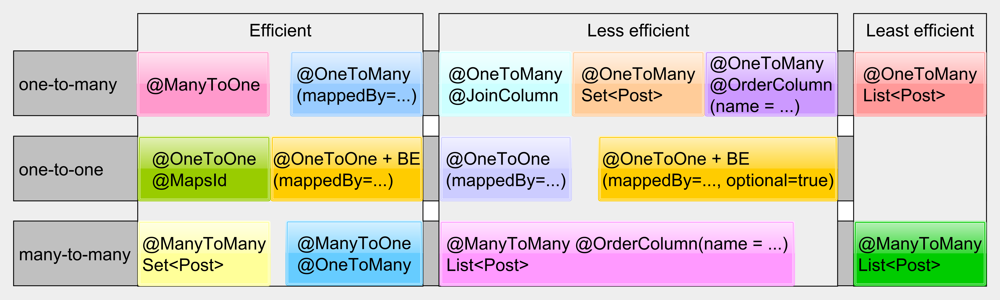

# Boas Práticas de Spring Data e Hibernate #

## 1. Introdução ##

Este repositório tem por objetivo reunir conteúdos sobre as boas práticas no uso do Spring Data JPA em conjunto com o Hibernate. Para isso, serão reunidos aqui diversos conteúdos de especialistas na área como [Vlad Mihalcea](https://vladmihalcea.com/ "https://vladmihalcea.com/") e [Thorben Janssen](https://thorben-janssen.com/ "https://thorben-janssen.com/"), bem como a documentação do próprio [Spring Data](https://docs.spring.io/spring-data/jpa/docs/current/reference/html/#reference"https://docs.spring.io/spring-data/jpa/docs/current/reference/html/#reference").

## 2. Questões Gerais ##

Em [14 High-Performance Java Persistence Tips](https://vladmihalcea.com/14-high-performance-java-persistence-tips/ "https://vladmihalcea.com/14-high-performance-java-persistence-tips/"), Mihalcea aborda uma série de questões relevantes que devem ser analisadas na construção da camada de persistência da aplicação. Algumas dicas são relacionadas ao Hibernate como: overview da eficiência entre os diferentes tipos de relacionamentos mapeados nas classes (Figura abaixo), a questão de somente recuperar dados necessários por meio de Projections e somente utilizar entidades quando houver necessidade de salvar os objetos.

Outros pontos abortados são as são relacionados a aspectos gerais de uso de banco de dados como pool de conexões, cache, entre outros pontos relevantes.

## 3. Mapeamento de Relacionamentos entre Entidades ##

A JPA possui uma série de mapeamentos possíveis entre entidades de banco de dados. Neste contexto, há uma série de questões que devem ser consideradas no momento de fazer o mapeamento. Como vimos na última figura, existem diversas abordagens para um mesmo tipo de relacionamento. Alguns mais eficientes, outros menos. Este capítulo tem por objetivo referênciar as melhores práticas para a realização das relações entre entidades.

### 3.1. Many To One e One To Many ###

O relacionamento @ManyToOne é o tipo mais comum de relacionamento utilizado nas aplicações. Ele também é o mais simples de ser feito de forma otimizada. Basicamente é feito um relacionamento na entidade "filho" indicando a coluna de join e o fetch lazy. Em [ManyToOne JPA and Hibernate association best practices](https://vladmihalcea.com/manytoone-jpa-hibernate/ "https://vladmihalcea.com/manytoone-jpa-hibernate/") são discutidas questões importantes que devem ser levadas em conta no uso de entidades com esse tipo de relacionamento. Como por exemplo o uso do "get" ao invés do "find" no momento de fazer associações, pois um não recupera dados da base e o outro executa o Select.

A JPA oferece também o mecanismo @OneToMany para mapear o mesmo tipo de relacionamento que o @ManyToOne atende. Neste caso, temos diversas questões que devem ser observadas. Pois a chance de fazer algo que dependa de mais tabelas ou que faça mais queries do que o necessário é alta. Em [The best way to map a @OneToMany relationship with JPA and Hibernate](https://vladmihalcea.com/the-best-way-to-map-a-onetomany-association-with-jpa-and-hibernate/ "https://vladmihalcea.com/the-best-way-to-map-a-onetomany-association-with-jpa-and-hibernate/") são expostos em detalhes todos os problemas que podem ocorrer quando estamos fazendo este tipo de relacionamento.

### 3.2. One To One ###

Os mapeamentos one to one são os mais polêmicos quando se fala em bancos relacionais, isso se dá pois em muitos casos é mais simples e seguro somente criar novas colunas na entidade "pai". Porém, existem algumas circunstâncias em que esse tipo de mapeamento se justifica. E seguindo mais ou menos a lógica do @ManyToOne, tendemos a implementar essa relação colocando um mapeamento da entidade pai na classe filha usando uma Foreign Key nesta última e mapeando também a classe filha na entidade pai utilizando a mesma anotação @OneToOne. Porém, isso gera necessariamente duas queries sempre que a entidade pai é recuperada. Em [The best way to map a @OneToOne relationship with JPA and Hibernate](https://vladmihalcea.com/the-best-way-to-map-a-onetoone-relationship-with-jpa-and-hibernate/ "https://vladmihalcea.com/the-best-way-to-map-a-onetoone-relationship-with-jpa-and-hibernate/") é demonstrada a melhor forma de fazer o mapeamento @OneToOne utilizando a anotação somente na classe filha e utilizando em conjunto a anotação @MapsId fazendo o uso do id da classe pai em ambas as classes. Isso, além de reduzir para uma query na recuperação da classe pai, também economiza um índice, já que a classe filha não precisa ter um id também.

### 3.3. Many To Many ###

A relação many to many naturalmente mais complexa que as outras relações e necessita sempre de uma tabela intermediária para ser concretizada. No mapeamento, porém, não temos uma entidade para essa tabela de ligação. Os mapeamentos são feitos por meio de coleções nas entidades relacionadas. Na figura da Seção 2, observamos que este relacionamento é considerado bem mais performático quando a coleção utilizada é o Set, ao invés de um List. Em [Best way to map the JPA and Hibernate ManyToMany relationship](https://vladmihalcea.com/the-best-way-to-use-the-manytomany-annotation-with-jpa-and-hibernate/ "https://vladmihalcea.com/the-best-way-to-use-the-manytomany-annotation-with-jpa-and-hibernate/"), é demonstrado como fazer este mapeamento utilizando Set e o ganho efetivo a nível de banco de dados em utilizar essa coleção ao invés de uma lista.

### 3.4. O Problema do Delete Cascade ###

O artigo [Cascade remove no JPA](https://emmanuelneri.com.br/2017/10/30/cascade-remove-no-jpa/ "https://emmanuelneri.com.br/2017/10/30/cascade-remove-no-jpa/"), demonstra de forma clara um problema que pode-se ter quando o CascadeType.ALL(ou DELETE) e orphanRemoval = true são utilizados para remoção das entidades relacionadas a uma entidade pai no banco de forma íntegra. Basicamente, o que pode ocorrer é um problema de performance dado que o Hibernate vai gerar uma query para remover cada item filho. Para resolver tal problema existem duas maneiras, a primeira é o delete cascade ser feito diretamente no banco de dados. Ou então, no nível de serviço, implementar toda a regra para remoção do objeto, removendo todas as entidades filhas (baseando-se no id da classe pai) e depois a entidade pai em um método com @Transactional (para que o rollback seja feito em caso de falha).

## 4. Projeção de Dados ##

O mapeamento ORM (Object Relational Mapper) traz grande facilidade no casamento entre o modelo de banco de dados e as classes do modelo orientado a objetos. Porém, as entidades podem tornar-se cada vez mais pesadas ao longo de um projeto, devido ao crescimento do modelo de dados. Com isso, o uso direto das entidades pode se tornar um risco para a performance do sistema. Portanto, na hora de desenvolver uma funcionalidade que vai lidar com dados deve-se fazer a seguinte pergunta: vou precisar persistir novamente a entidade que eu estou recuperando ou vou utilizá-la somente como leitura para fazer algum processamento?

Caso seja necessária a persistência da entidade no final do processo, devemos recuperar o objeto mapeado. Agora caso o objeto seja somente utilizado no modo leitura deve-se utilizar as [Projections](https://docs.spring.io/spring-data/jpa/docs/current/reference/html/#projections "https://docs.spring.io/spring-data/jpa/docs/current/reference/html/#projections"). Este mecanismo possibilita a recuperação somente dos atributos/colunas que são necessários à regra de negócio que está sendo implementada. Fazendo uma analogia com o uso do banco de dados dessa forma deixamos de fazer um "select * from" para selecionar as colunas que realmente precisamos. Isso é bom em diversos sentidos, pois não serão carregados mais dados do que o necessário e o eventual crescimento da entidade não impactará na performance do código desenvolvido.